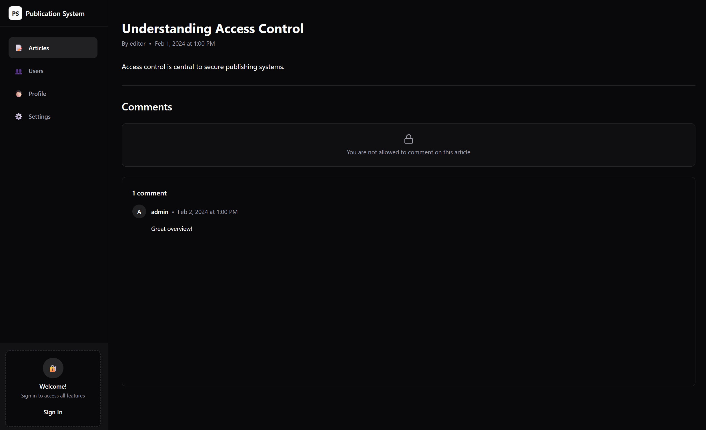

# Publication System Frontend

React client for a digital publishing platform — article workflows, account management, and **RBAC / ABAC** access control against a companion API.

Built at **Gdańsk University of Technology** for *Introduction to Cybersecurity*, as the frontend companion to the [Publication System API](https://github.com/varev-dev/publication-system-api).

## [Live demo](https://patryk-przybysz.github.io/publication-system-frontend)



## Quick start

1. Install [Bun](https://bun.sh), then clone and install:

   ```bash
   git clone https://github.com/patryk-przybysz/publication-system-frontend
   cd publication-system-frontend
   bun install
   ```

2. Run against the [backend API](https://github.com/varev-dev/publication-system-api), **or** enable MSW mocks:

   ```bash
   # .env.local
   VITE_ENABLE_API_MOCKING=true
   ```

3. Start the app:

   ```bash
   bun dev
   ```

   Opens at [http://localhost:3000](http://localhost:3000).

## Testing

```bash
bun run test              # all projects
bun run test:unit         # Node unit tests (*.test.ts)
bun run test:browser      # Browser tests (*.test.tsx)
```

First run: `bunx playwright install chromium` (browser tests need Chromium binaries).

## Stack

- React 19 · TypeScript · Vite
- TanStack Router & Query
- Tailwind CSS v4 · Radix / shadcn/ui
- Vitest Browser Mode (Playwright) · MSW

## Project structure

Layout inspired by [Bulletproof React](https://github.com/alan2207/bulletproof-react):

```
src/
├── app/          # routing & providers
├── features/     # feature modules
├── components/   # shared UI
├── lib/          # auth, API, query client
└── testing/      # MSW handlers & test helpers
```

---

Backend setup and API docs: [publication-system-api](https://github.com/varev-dev/publication-system-api/blob/main/README.md).
